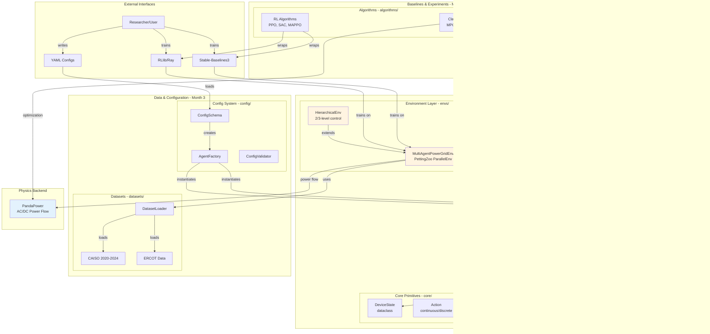

# PowerGrid 2.0: Implementation Design Diagrams

**Purpose**: Visual guides for 3-person team implementation
**Date**: October 2025
**Version**: 1.0

---

## Diagram Index

1. [System Architecture Overview](#1-system-architecture-overview)
2. [Class Hierarchy Diagram](#2-class-hierarchy-diagram)
3. [Agent Lifecycle Sequence](#3-agent-lifecycle-sequence)
4. [Environment Step Flow](#4-environment-step-flow)
5. [Data Flow Architecture](#5-data-flow-architecture)
6. [Module Dependency Graph](#6-module-dependency-graph)
7. [Experiment Pipeline](#7-experiment-pipeline)
8. [Baseline Integration Architecture](#8-baseline-integration-architecture)
9. [Implementation Phases](#9-implementation-phases)
10. [Team Responsibilities Matrix](#10-team-responsibilities-matrix)

---

## 1. System Architecture Overview



---

## 2. Class Hierarchy Diagram


---

## 3. Agent Lifecycle Sequence


---

## 4. Environment Step Flow

```mermaid
flowchart TD
    Start([step actions])

    subgraph "1. Action Distribution"
        A1[Parse action_dict by agent_id]
        A2[For each DeviceAgent:<br/>agent.set_action]
        A3[Device.action.c/d = values]
    end

    subgraph "2. State Update - Physics"
        B1[For each Device:<br/>device.update_state]
        B2{Device Type?}
        B3[DG: P = P_min + action * range<br/>Q = tan × P]
        B4[ESS: P = action × P_max<br/>SOC += P × dt]
        B5[RES: P = action × scaling<br/>Q = reactive power]
    end

    subgraph "3. Pandapower Sync"
        C1[Push device states to net]
        C2[net.sgen.at = DG.state.P]
        C3[net.storage.at = ESS.state.SOC]
        C4[net.shunt.at = Shunt.Q]
    end

    subgraph "4. Power Flow Solution"
        D1[pp.runpp]
        D2{Converged?}
        D3[Get results:<br/>vm_pu, va_degree, loading]
        D4[Set failed flag]
    end

    subgraph "5. Cost & Safety"
        E1[For each Device:<br/>update_cost_safety]
        E2[DG: cost = fuel_cost × P]
        E3[ESS: safety = SOC_violation]
        E4[Voltage: safety = |V - 1.0|]
    end

    subgraph "6. Reward Computation"
        F1[Call _reward_and_safety]
        F2[Per-device rewards]
        F3[Aggregate: sum or weighted]
        F4[Apply safety penalty]
    end

    subgraph "7. Observation"
        G1[For each Agent:<br/>agent.observe]
        G2[Local: device state]
        G3[Global: bus voltages]
        G4[Messages: mailbox]
    end

    subgraph "8. Communication Protocol"
        H1{Protocol enabled?}
        H2[protocol.coordinate]
        H3[Broadcast messages]
        H4[Update agent mailboxes]
    end

    End([Return: obs, rewards, dones, info])

    Start --> A1
    A1 --> A2
    A2 --> A3
    A3 --> B1

    B1 --> B2
    B2 --> B3
    B2 --> B4
    B2 --> B5
    B3 --> C1
    B4 --> C1
    B5 --> C1

    C1 --> C2
    C2 --> C3
    C3 --> C4
    C4 --> D1

    D1 --> D2
    D2 -->|Yes| D3
    D2 -->|No| D4
    D3 --> E1
    D4 --> E1

    E1 --> E2
    E1 --> E3
    E1 --> E4
    E2 --> F1
    E3 --> F1
    E4 --> F1

    F1 --> F2
    F2 --> F3
    F3 --> F4
    F4 --> G1

    G1 --> G2
    G2 --> G3
    G3 --> G4
    G4 --> H1

    H1 -->|Yes| H2
    H1 -->|No| End
    H2 --> H3
    H3 --> H4
    H4 --> End

    style Start fill:#e8f5e9
    style End fill:#e8f5e9
    style D1 fill:#e3f2fd
    style D2 fill:#fff3e0
```

---

## 5. Data Flow Architecture

```mermaid
graph LR
    subgraph "Data Sources - Month 3 Week 9"
        CAISO[(CAISO OASIS<br/>2020-2024<br/>Load/Solar/LMP)]
        ERCOT[(ERCOT<br/>Load/Wind)]
        NREL[(NREL NSRDB<br/>Solar Profiles)]
    end

    subgraph "Data Pipeline - datasets/"
        Download[DataDownloader<br/>auto-fetch from APIs]
        Preprocess[Preprocessor<br/>clean, interpolate]
        Align[TimeseriesAligner<br/>match timestamps]
        Split[TrainTestSplitter<br/>2020-2022 train<br/>2023-2024 test]
        Cache[DataCache<br/>~/.powergrid/data/]
    end

    subgraph "Dataset Objects"
        TSDataset[TimeseriesDataset<br/>load[t], solar[t], price[t]]
        SpatialDS[SpatialDataset<br/>bus locations, topology]
    end

    subgraph "Environment Integration"
        Env[MultiAgentPowerGridEnv]
        Loader[DatasetLoader]
    end

    subgraph "Device Consumption"
        RES[RES Device<br/>scaling = solar[t]]
        Grid[Grid Device<br/>price = lmp[t]]
        Load[Load Scaling<br/>net.load.scaling = load[t]]
    end

    CAISO -->|download| Download
    ERCOT -->|download| Download
    NREL -->|download| Download

    Download --> Preprocess
    Preprocess --> Align
    Align --> Split
    Split --> Cache

    Cache --> TSDataset
    Cache --> SpatialDS

    TSDataset --> Loader
    SpatialDS --> Loader
    Loader --> Env

    Env --> RES
    Env --> Grid
    Env --> Load

    style CAISO fill:#e3f2fd
    style Cache fill:#fff3e0
    style Env fill:#fff4e1
```

---

## 6. Module Dependency Graph


**Implementation Order** (follow layer numbers):
1. Core primitives (Week 1)
2. Devices (Week 1-2)
3. Agents (Week 2-3)
4. Protocols (Week 7, can defer)
5. Environments (Week 4-6)
6. Datasets (Week 9)
7. Configuration (Week 5-6)
8. Baselines (Week 10-11)
9. Benchmarks (Week 12-13)

---

## 7. Experiment Pipeline


**Key Metrics to Track**:
- Episode return (primary)
- Steps to convergence
- Training time
- Memory usage
- Safety violations (%)
- Power flow convergence rate

---

## 8. Baseline Integration Architecture


**Baseline Implementation Priority**:
1. **Week 10**: PPO, IPPO, MAPPO (RLlib)
2. **Week 11**: SAC (SB3), MPC (CVXPY)
3. **Week 12**: OPF (PandaPower), H-MAPPO
4. **Defer to NeurIPS**: QMIX, MADDPG

---

## 9. Implementation Phases


---

## 10. Team Responsibilities Matrix


---

## Quick Reference: Key Files to Implement

### Month 1 (Agent Abstraction)
```
powergrid/
├── agents/
│   ├── __init__.py
│   ├── base.py              # Agent ABC (Architect, Week 1)
│   ├── device_agent.py      # DeviceAgent wrapper (Architect, Week 1-2)
│   ├── grid_agent.py        # GridCoordinatorAgent (Architect, Week 2-3)
│   └── policies.py          # Policy interfaces (Architect, Week 3)
├── core/
│   ├── state.py             # DeviceState (existing, minor updates)
│   └── actions.py           # Action (existing, minor updates)
└── devices/
    ├── base.py              # Device ABC (Domain, refactor Week 1-2)
    ├── generator.py         # DG as agent (Domain, Week 2)
    ├── storage.py           # ESS as agent (Domain, Week 2)
    └── ...                  # Other devices (Domain, Week 3)
```

### Month 2 (Multi-Agent Environment)
```
powergrid/
├── envs/
│   ├── multi_agent/
│   │   ├── __init__.py
│   │   ├── base.py          # MultiAgentPowerGridEnv (Architect, Week 5-6)
│   │   ├── ieee13.py        # 3-agent example (Domain, Week 5)
│   │   └── ieee34.py        # 5-agent example (Domain, Week 6)
│   └── hierarchical/
│       ├── __init__.py
│       └── base.py          # HierarchicalEnv (Domain, Week 7)
└── config/
    ├── __init__.py
    ├── loader.py            # ConfigLoader (Architect, Week 6-7)
    ├── schema.py            # YAML schema (DevOps, Week 6)
    └── factory.py           # AgentFactory (Architect, Week 7)
```

### Month 3 (Data & Baselines)
```
powergrid/
├── datasets/
│   ├── __init__.py
│   ├── loaders.py           # DatasetLoader (Domain, Week 9)
│   ├── preprocessors.py     # Preprocessing (Domain, Week 9)
│   └── caiso.py             # CAISO dataset (Domain, Week 9)
├── algorithms/
│   ├── __init__.py
│   ├── base.py              # BaseAlgorithm ABC (Architect, Week 10)
│   ├── rl/
│   │   ├── rllib_wrapper.py # RLlib integration (Architect, Week 10)
│   │   └── sb3_wrapper.py   # SB3 integration (Architect, Week 10)
│   └── classical/
│       ├── mpc.py           # MPC baseline (Domain, Week 11)
│       └── opf.py           # OPF baseline (Domain, Week 11)
└── benchmarks/
    ├── __init__.py
    ├── tasks.py             # 5 benchmark tasks (Domain, Week 11)
    ├── runner.py            # Experiment runner (DevOps, Week 11)
    └── metrics.py           # Metrics logger (DevOps, Week 11)
```

### Month 4 (Experiments)
```
experiments/
├── configs/
│   ├── task1_voltage.yaml   # Config for Task 1 (Domain, Week 12)
│   ├── task2_dispatch.yaml  # Config for Task 2 (Domain, Week 12)
│   └── ...
├── scripts/
│   ├── train.py             # Training script (DevOps, Week 12)
│   ├── eval.py              # Evaluation script (DevOps, Week 12)
│   └── analysis.py          # Statistical analysis (Domain, Week 15)
├── results/
│   ├── logs/                # Training logs (auto-generated)
│   ├── checkpoints/         # Model checkpoints (auto-generated)
│   └── figures/             # Plots for paper (Domain, Week 15)
└── paper/
    ├── paper.tex            # LaTeX source (All, Week 16-17)
    ├── figures/             # Camera-ready figures (Domain, Week 15)
    └── supplement.pdf       # Supplementary material (DevOps, Week 17)
```

---

## Additional Visual Aids

### Communication Protocol Flow


### Hierarchical Control Flow


---

## Usage Guide for Team

### For Architect
**Focus on**: Diagrams 1, 2, 3, 4, 6, 8
- Use diagram 2 (Class Hierarchy) to design inheritance structure
- Use diagram 3 (Agent Lifecycle) for initialization logic
- Use diagram 4 (Step Flow) for environment implementation
- Use diagram 6 (Dependencies) to avoid circular imports

### For Domain Engineer
**Focus on**: Diagrams 1, 4, 5, 7, 9
- Use diagram 4 (Step Flow) to understand device state updates
- Use diagram 5 (Data Flow) for dataset integration
- Use diagram 7 (Experiment Pipeline) for benchmark setup
- Use diagram 9 (Timeline) to track progress

### For DevOps
**Focus on**: Diagrams 6, 7, 9, 10
- Use diagram 6 (Dependencies) for test coverage
- Use diagram 7 (Experiment Pipeline) for infrastructure setup
- Use diagram 9 (Timeline) for CI/CD milestones
- Use diagram 10 (Responsibilities) to coordinate reviews

---

## Next Steps

1. **Print or display** these diagrams during kickoff meeting
2. **Reference diagram numbers** in code comments (e.g., "See Diagram 4, Step 2")
3. **Update diagrams** as design evolves (living document)
4. **Use for onboarding** new contributors

---

**Document Version**: 1.0
**Last Updated**: October 2025
**Status**: Ready for Implementation
